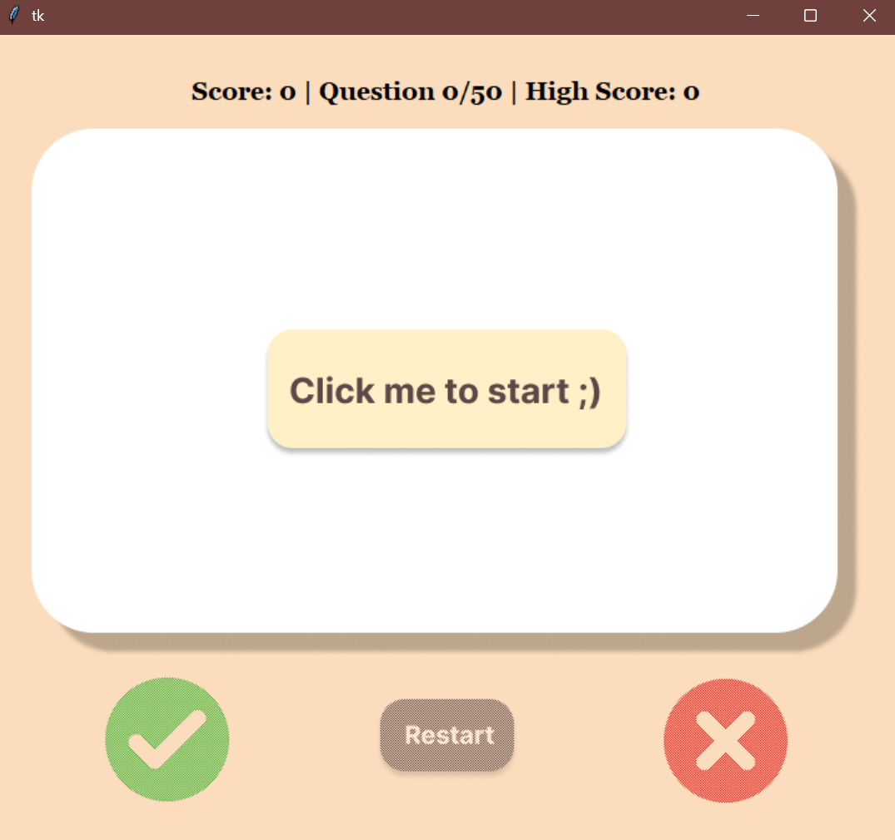
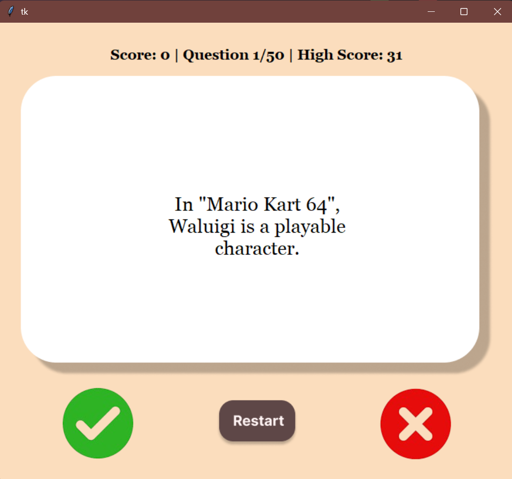
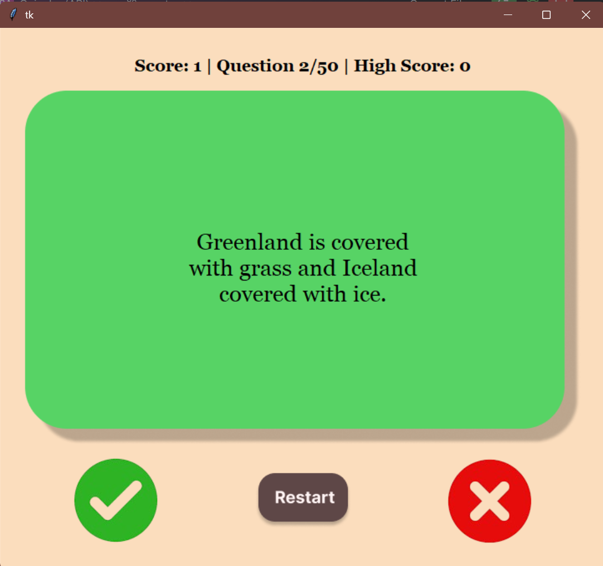
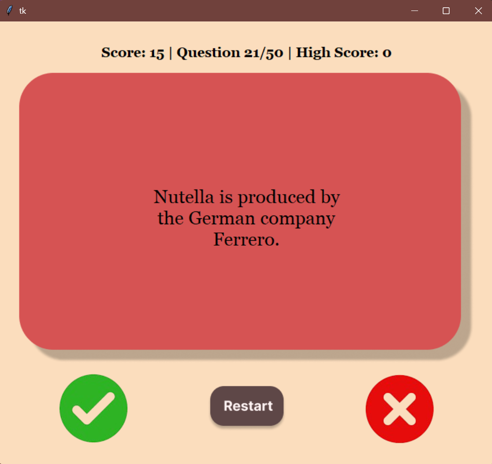
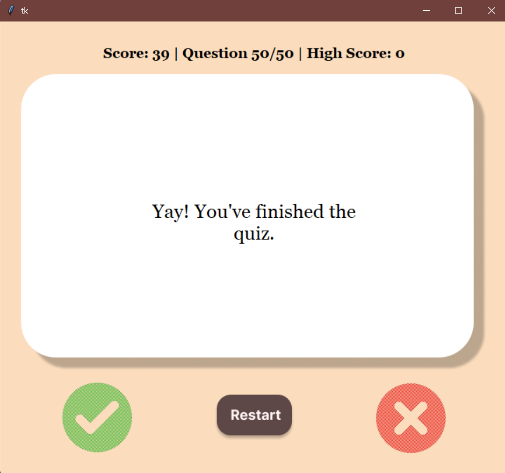

# Tkinter Trivia Quiz (API Version)

A GUI trivia quiz built using **Python** and **Tkinter**, powered by the **Open Trivia Database API**.

This project fetches real-time True/False trivia questions and presents them in a simple interactive desktop application.

---

## Features

• Fetches 50 trivia questions from the Open Trivia API.
• True / False quiz gameplay.
• Score tracking during the quiz.
• Persistent **high score system** using a text file.
• Visual feedback for correct and incorrect answers.
• Restart functionality.
• Start screen interface.

---

## Screenshots

### Start Screen



### Question Example



### Answer Feedback





### Final Screen



---

## Project Structure

```
Quizzer_API_version
│
├── images/           # UI assets
├── screenshots/      # README images
├── attributes.py     # Score and question tracking
├── data.py           # API request logic
├── ui.py             # Tkinter interface and quiz logic
├── main.py           # Program entry point
└── highscore.txt     # Stores persistent high score
```

---

## Other Quiz Projects

This project is part of a small series of quiz applications I built while learning different technologies.

• **Web Quiz (HTML, CSS, JavaScript)**
• **Python OOP Terminal Quiz**
• **Tkinter Trivia Quiz (this project)**

You can explore them in my GitHub repositories.

---

## API Used

Open Trivia Database
https://opentdb.com
